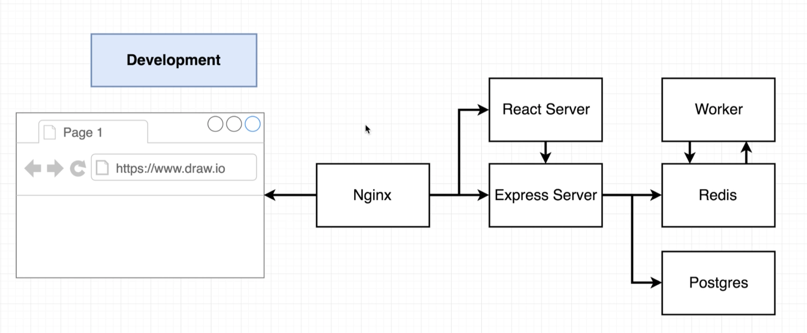
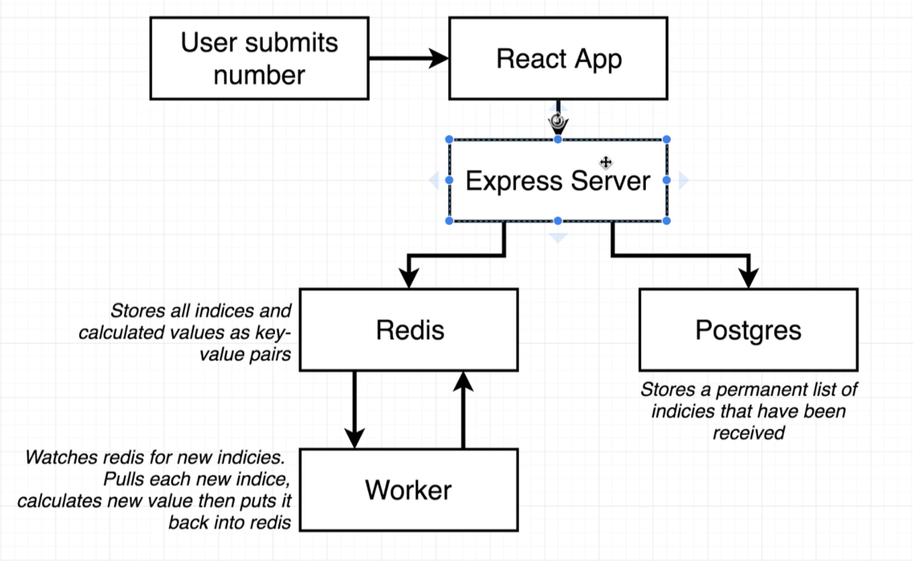

# Application Architecture




```js
function fib(index) {
	if (index < 2) return 1;
	return fib(index - 1) + fib(index - 2);
}
// How does our Fib function work?
// Example:
// fib(5) = ? 
// fib(4) + fib(3)

// fib(4) = ? 
// fib(3) + fib(2)

// fib(3) = ?
// fib(2) + fib(1)

// fib(2) = ?
// fib(1) + fib(0)

// fib(1) = 1
// fib(0) = 1 

// so...

// fib(2) = 1 + 1 = 2
// fib(3) = 2 + 1 = 3
// fib(4) = 3 + 2 = 5
// fib(5) = 5 + 3 = 8
```